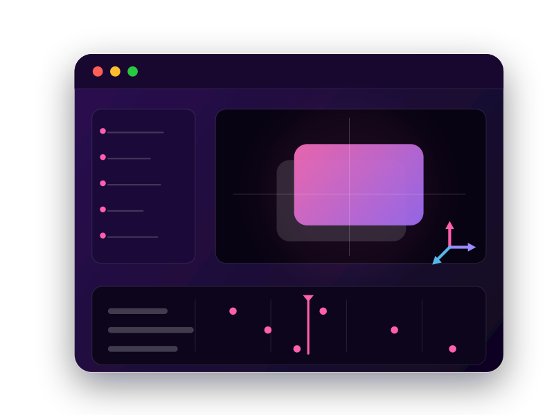

<Superhero variant="halfWidth" textColor="white" slots="heading, text, image" background="linear-gradient(135deg, #24104F 0%, #5C2B91 100%)"/>

# Extend the Power of After Effects

Extend the application with plugins, scripts, and panels that integrate into existing workflows. Create visual effects, manipulate project elements, and automate complex tasks using After Effects APIs.

<Resources slots="heading, links"/>

#### Resources

* [Quickstart Guide](https://developer.adobe.com)
* [UXP Hub](https://developer.adobe.com/uxp/?aio_external)
* [After Effects API](after-effects-api/index.md)

## Overview

A UXP plugin uses shared UXP platform APIs together with host-specific APIs. Start with the path that matches what you need.

<Cards slots="image, heading, text, links" repeat="2" width="100%" />

### Learn the UXP platform

Walk through the full developer journey: build your first plugin, learn the platform and UXP APIs, and publish plugins.

[Start in the UXP Hub](https://developer.adobe.com/uxp/?aio_external)

### Use the After Effects API

Explore the After Effects API reference for application, project item, layer, property, file, font, import option, and settings APIs.

[View the After Effects API](after-effects-api/index.md)

**Note:** Start with the [UXP Hub](https://developer.adobe.com/uxp/?aio_external) to learn the fundamentals, core concepts, and the plugin development model. Use this Adobe After Effects UXP documentation for After Effects APIs, examples, and workflows. We will keep expanding these resources with more documentation and sample code throughout the beta.

## Explore APIs

Plugins use both shared UXP APIs and host-specific After Effects APIs. The shared APIs provide capabilities such as file access, storage, networking, HTML, CSS, and Spectrum UI.

<DiscoverBlock slots="link, text"/>

[After Effects API Reference](after-effects-api/index.md)

Application, project item, layer, property, file source, font, import option, and settings APIs for After Effects plugins.

<DiscoverBlock slots="link, text"/>

[UXP API Reference](https://developer.adobe.com/uxp/uxp-api/?aio_external)

File system, networking, storage, HTML, CSS, and Spectrum UI capabilities shared by UXP hosts.

## Join the Community

Join the worldwide community of Creative Cloud Developers building plugins and integrations to empower creativity.

Have questions while developing, or want to share feedback on the UXP documentation, APIs, samples, or other developer resources?

[Join the conversation in the Creative Cloud Developer Forums](https://forums.creativeclouddeveloper.com/) to connect with other developers, share your experiences, ask questions, and get support from the community.

Want to stay up to date with the latest developer news?

- [Subscribe to the Adobe Creative Cloud Developer Newsletter](https://www.adobe.com/subscription/ccdevnewsletter.html).
